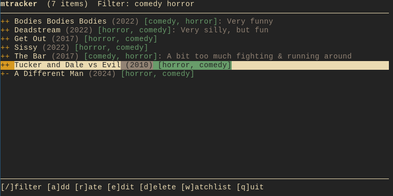

# mtracker
mtracker is a simple tool for Linux that lets you keep track of watched movies
and series. Or any other kind of media, like books and video games.

* Interactive TUI and traditional CLI interface.
* Designed to work well with standard Linux command line tools like grep.
* Flat file system: All data is saved in a human-readable text file.
* No built-in cloud synchronization. Of course, you can set up some kind of
  synchronization yourself if you wish to.
* Works offline. Optionally, `mtracker sync` fetches genres, IMDb ratings and
  directors from IMDb's public datasets - no account, no API key. Nothing
  touches the network unless you run it.




## Installation
If you have Rust installed, you can simply use cargo:
```bash
cargo install mtracker
```

Otherwise just download the latest
[release](https://github.com/r-unruh/mtracker/releases) and put it somewhere
within your PATH variable, e.g.: `/usr/local/bin`
```bash
sudo curl -o /usr/local/bin/mtracker https://github.com/r-unruh/mtracker/releases/latest/download/mtracker
```

Don't forget to make the file executable:
```bash
sudo chmod +x /usr/local/bin/mtracker
```


## Tutorial
Let's assume your friend Max tells you about a fun horror movie. This is how
you add it to your watchlist:
```bash
mtracker add "Pearl (2022)" --tag=watchlist --note="Recommended by Max"
```

After watching the movie you decide to rate it a 8/10:
```bash
mtracker rate "Pearl (2022)" 8
```

This command assumes that you have now watched the item and removes it from the
watchlist automatically.

You can rate movies you already know directly without having to add them first:
```bash
mtracker rate "Session 9 (2001)" 10
mtracker rate "In Fabric (2018)" 4
```

Now lets see what we have so far by listing all items:
```bash
mtracker ls
```

Which returns this list, sorted by rating:
```bash
++++++++++ Session 9 (2001)
++++++++-- Pearl (2022)
+++------- In Fabric (2018)
```

This should cover the basics. Type `mtracker help [subcommand]` to see all
options.

> [!NOTE]
> Commands are not yet stable and may change in future versions.
> Make sure to backup your database on a regular basis.


## TUI
Launch the interactive terminal interface by running mtracker without any
subcommand:
```bash
mtracker
```

The TUI provides vim-style navigation and quick actions for managing your
database without having to type out full commands.

### Keybindings

Key                    | Action
-----------------------|--------
`j` / `k`              | Move down / up
`g` / `G`              | Jump to first / last item
`Ctrl+d` / `Ctrl+u`    | Half-page down / up
`/`                    | Filter items
`a`                    | Add new item (opens `$EDITOR`)
`e`                    | Edit selected item (opens `$EDITOR`)
`r`                    | Rate selected item
`w`                    | Toggle watchlist
`d`                    | Delete selected item (with confirmation)
`o`                    | Open selected item in the browser (`i` IMDb, `t` TMDB, `l` Letterboxd)
`Esc`                  | Clear filter, or quit
`q`                    | Quit


## Database
The database is just a plain text file that you can edit by hand. It looks like
this:
```
Forrest Gump
year: 1994
rating: 9
tags: drama, comedy
imdb: tt0109830
last_seen: 2020-12-31

Bodies Bodies Bodies
year: 2022
tags: watchlist
note: recommended by Max

Whiplash
rating: 10
```

You can also open the whole database in your editor with `mtracker edit`. The
file is validated before saving, so typos won't corrupt your data.

`imdb` is the item's IMDb id, written by `mtracker sync` (see below). It's the
only thing sync ever adds to the file: genres, ratings and directors live in a
separate cache, so the database stays exactly what you typed.

On Linux, the database file is automatically created and stored in
`~/.local/share/mtracker/db.txt`. If any relevant XDG environment variables
(e.g., `XDG_DATA_HOME`) are set, they will be respected, and the file will be
stored according to the [XDG Base Directory
Specification](https://specifications.freedesktop.org/basedir-spec/latest/).


## Features
### Ratings
You can rate movies on a scale of your choice. mtracker doesn't force a rating
system. The highest rated item in your database determines the scale: If the
highest rated movie is a 7, then all the ratings go from 0 to 7. Of course, you
don't *have* to rate anything at all.

Here are a few options:

<table>
  <tr>
    <th>Rating Scale</th>
    <th>Explanation</th>
  </tr>
  <tr>
    <td>1 to 10</td>
    <td>You can rate the way most movie websites do.</td>
  </tr>
  <tr>
    <td>1 to 5</td>
    <td>
      In case you prefer fewer options, this might be better. There are no
      decimal numbers though.
    </td>
  </tr>
  <tr>
    <td>0 to 1</td>
    <td>
      Binary mode, or: Like/Dislike. Most simple! Ratings don't have to start
      at 1.
    </td>
  </tr>
  <tr>
    <td>0 to 2</td>
    <td>
      <p>
        If you often find yourself neither liking nor disliking movies, you may
        need a third option. This is the system I'm using:
      </p>
      <ul>
        <li>2 = Like</li>
        <li>1 = Okayish</li>
        <li>0 = Dislike</li>
      </ul>
    </td>
  </tr>
</table>

### Tags
You can tag movies and filter by tags when listing them later. `watchlist` is a
special tag that highlights items and puts them on top of everything else.

### IMDb sync
Typing tags by hand gets old. `mtracker sync` links your items to IMDb and
fetches genres, IMDb ratings and directors:
```bash
mtracker sync --dry-run   # show what would be linked, change nothing
mtracker sync             # link everything that isn't linked yet
mtracker sync "Alien (1979)"
```

On first run it downloads IMDb's [non-commercial
datasets](https://developer.imdb.com/non-commercial-datasets/) (~600 MB, no
account or API key needed) into `~/.cache/mtracker/imdb/`. They are reused
afterwards; `--download` refreshes them.

Items are matched by name and year. When several IMDb titles share both, the
most popular one wins. Items already carrying an `imdb` id are never
re-matched - if a match is wrong, just edit the id. Items that can't be matched
are listed at the end, which doubles as a typo check for your database.

In the TUI, genres appear dimmed in the tag list after your own tags; `ls`
shows them with `--genres`, and `--imdb` adds the IMDb rating and directors.
Tags that merely repeat a genre are hidden. Genres, directors and the title type (`movie`, `series`, ...)
can be used as filter terms.

Information courtesy of IMDb (https://www.imdb.com). Used with permission.

### Filtering
When listing items (with `ls` or in the TUI), you can filter by combining
search terms. All terms must match (AND logic). Prefix a term with `!` to
negate it.

Term                | Meaning
--------------------|--------------
`<tag>`             | Items with this tag
`<text>`            | Items whose name contains `<text>`
`<genre>`           | Items with this IMDb genre (after `sync`)
`<director>`        | Items whose director's name contains `<director>`
`movie` / `series`  | Items of this IMDb title type
`rated`             | Items that have a rating
`unrated`           | Items without a rating
`++`                | Items with a rating of at least 2
`---`               | Items with at least 3 minuses
`++-`               | Items with an exact rating of 2
`<year>`            | Items released in `<year>`
`<year>-<year>`     | Items released between the two years
`-<year>`           | Items released before or in `<year>`
`<year>-`           | Items released after or in `<year>`
`!<term>`           | Exclude items matching `<term>`


## Command examples
Command                                               | Action
------------------------------------------------------|--------------
`mtracker ls`                                         | List all items
`mtracker ls horror comedy`                           | List items tagged both horror and comedy
`mtracker ls horror 2022-2024`                        | List horror movies released between 2022 and 2024
`mtracker ls rated '!horror'`                         | List all rated items that are not tagged horror
`mtracker ls --genres '!horror'`                      | List non-horror items, showing IMDb genres
`mtracker ls --imdb östlund`                          | List items by Ruben Östlund with IMDb rating
`mtracker sync`                                       | Link items to IMDb and fetch genres, ratings, directors
`mtracker add "Aliens (1986)" --tag=watchlist,horror` | Add new item with tags OR add tags to an existing item
`mtracker rate "Aliens (1986)" 5`                     | Rate item a 5 (and remove from watchlist)
`mtracker edit`                                       | Open the whole database in your editor
`mtracker edit "Aliens (1986)"`                       | Edit a specific entry in your editor
`mtracker`                                            | Launch the interactive TUI
